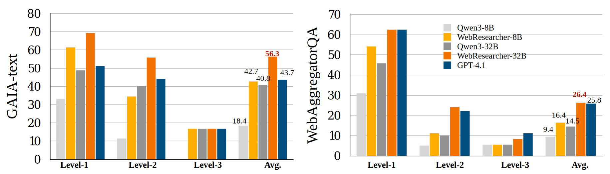
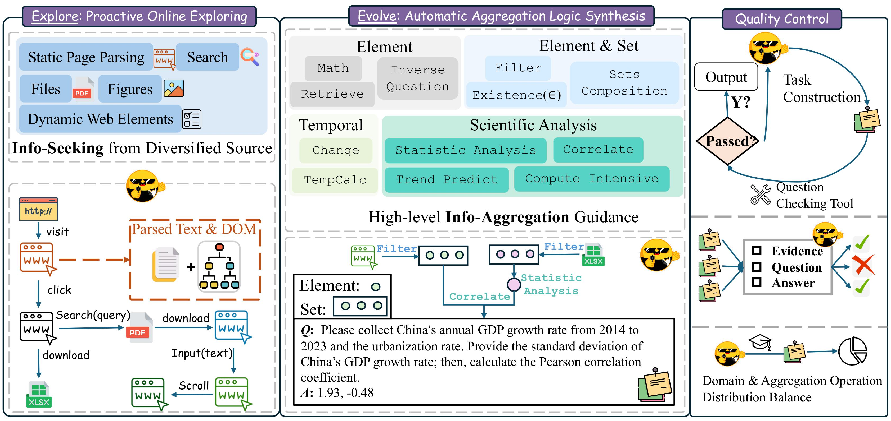

# 🌐 *Explore to Evolve*: Scaling Evolved Aggregation Logic via Proactive Online Exploration for Deep Research Agents

## 🌟 Introduction

[](https://arxiv.org/abs/) [](https://huggingface.co/datasets/Ray121381/WebAggregatorQA) [](https://huggingface.co/Ray121381/WebAggregator) 




- ***Explore to Evolve*** aims to generate diverse, high-quality training data for web agent foundation models, enhancing their capabilities in multi-tool usage, **information seeking**, and **information aggregation**.

- WebAggregator, the finetuned model on WebAggregatorQA, demonstrates strong performance on GAIA-text and the WebAggregatorQA test set.


---

## ✨ Features



- 🤖 **Fully Automated and Verifiable QA Construction**  
- 😄 **Open Source**: Complete codebase including QA construction engine, queries, trajectories, and models.
- 👍 **Highly Customizable**: Collect data tailored to your needs with minimal human effort, and easily customize your own agent!


---

## ⚡ Quick Start

Follow these steps to get started:

### 1️⃣ Clone the Repository

```bash
git clone <repository_url>
```

### 2️⃣ Install Dependencies

1. This project builds upon smolagents’ “open deep research” example 👉 [smolagents open_deep_research dependencies](https://github.com/huggingface/smolagents/tree/main/examples/open_deep_research). Thanks for their great work and please cite them!

2. Install this project’s requirements:

```bash
pip install -r requirements.txt
```


3. **Please note**: the implementation must utilize the `./smolagents`, which provides the added functionality for trajectory collection by us. Or you can directly replace the smolagets/agents.py in your original library.


---

## 🚀 Usage

### ⚙️ Configuration

- `./web_tools.py`: Tools for agent. You could modify it to suit your needs.
- `./run_agent.py`: The implemented agent.
- `./config.py`: Configure your agent’s foundation LLM, and LLMs supporting specific tools.
- `./model_list.py`: Implement the way to call your agent foundations, e.g., vLLM, liteLLM, or Azure. We provide an example, and more details could be found from the smolagents repo.
- `./run`: Scripts for running the agent.
- `./data`: Input data for QA construction (URLs), evaluation (Benchmarks) and traj sampling (QAs).

---

### ▶️ Running the Project

> **Note:** Before running any scripts, ensure all paths, model checkpoints, and other necessary parameters are properly set in the source files.

---

#### 1️⃣ Evaluation

To evaluate your agent, serve your tuned checkpoint and update the corresponding settings in `config.py`. Make sure the correct `model_id` is set in the evaluation script `test.sh`, then run:


```bash
bash run/test.sh
```

This command evaluates your specified model and benchmark. After evaluation, it uses LLM-as-judge to assess performance and prints the accuracy.

---

#### 2️⃣ QA Construction

Start building automatic web agent data:

1. Download our collected URLs 👉 [URLs](https://huggingface.co/datasets/Ray121381/WebAggregatorQA) **or** gather URLs related to your domains of interest!

2. Then, run the following command to collect the data.

```bash
bash run/QA_building.sh
```

---

#### 3️⃣ Trajectory Sampling

Training trajectories for fine-tuning your agent foundation models are available at 👉 [WebAggregatorQA](https://huggingface.co/datasets/Ray121381/WebAggregatorQA). Sample data can be found in `./data/train-samples` for initial testing purposes.

```bash
bash run/traj_sampling.sh
```


---

## Citation

```bibtex
@misc{webagg,
  author = {},
  title = {Explore to Evolve: Scaling Evolved Aggregation Logic via Proactive Online Exploration for Deep Research Agents},
  year = {2025},
  howpublished = {}
}

@misc{fang2025cognitivekernelpro,
      title={Cognitive Kernel-Pro: A Framework for Deep Research Agents and Agent Foundation Models Training}, 
      author={Tianqing Fang and Zhisong Zhang and Xiaoyang Wang and Rui Wang and Can Qin and Yuxuan Wan and Jun-Yu Ma and Ce Zhang and Jiaqi Chen and Xiyun Li and Hongming Zhang and Haitao Mi and Dong Yu},
      year={2025},
      eprint={2508.00414},
      archivePrefix={arXiv},
      primaryClass={cs.AI},
      url={https://arxiv.org/abs/2508.00414}, 
}
```
